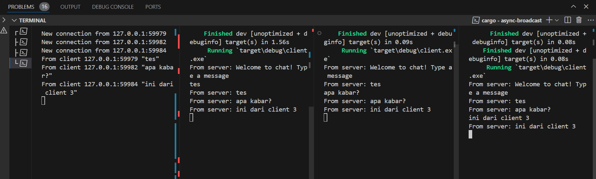
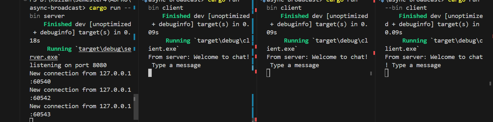
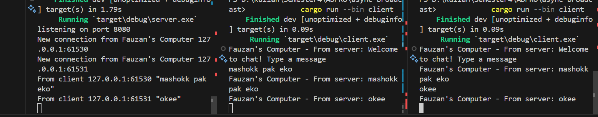

# advprog-module10-async-broadcast

## 2.1 Original code of broadcast chat

Menjalankan 1 server dan 3 client


Untuk menjalankannya, buka 4 terminal terlebih dahulu. Jalankan perintah berikut pada 1 terminal yang akan berperan menjadi server
```rust
cargo run --bin server
```
Kemudian jalankan perintah berikut pada 3 terminal lainnya
```rust
cargo run --bin client 
```

Server berperan sebagai penghubung antara client-client yang terhubung. Setiap client mengirim pesan, server akan menerima pesan dari client tersebut dan mengirimkannya ke tiap client yang terhubung dengan server.

## 2.2. Modifying the websocket port

Untuk mengubah port websocket, kita perlu mengubahnya pada file `server.rs` dan `client.rs`. untuk `server.rs` ubah port pada baris 44, sedangkan untuk `client.rs` ubah port pada baris 10.

Server menggunakan TCP listener, sementara client terhubung dengan client menggunakan websocket. Pastikan port yang digunakan oleh server dan client sama.

Setelah mengganti port menjadi 8080


## 2.3: Small changes, add IP and Port

Untuk menampilkan nama server pada terminal client, saya mengubah kode pada `client.rs` baris ke 23 menjadi
```rust
println!("Fauzan's Computer - From server: {}", text);
```

Kemudian pada `server.rs` baris ke 49, saya mengubah kode menjadi
```rust
println!("New connection from Fauzan's Computer {addr:?}");
```

Saya melakukan perubahan di kedua file tersebut agar nama server yang terhubung dengan client dapat terlihat pada terminal client dan sebaliknya. Berikut adalah hasilnya:
